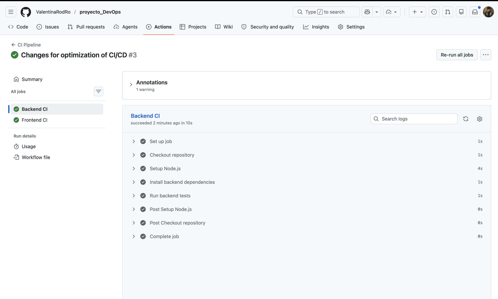
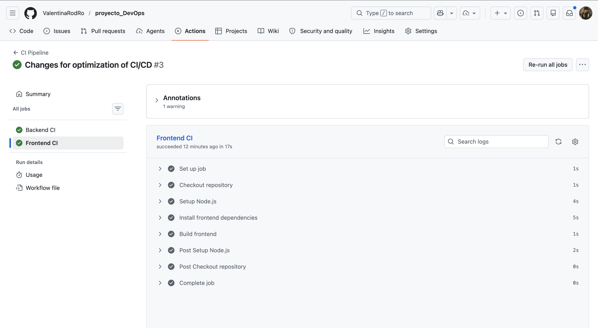

Aquí tienes un `README.md` completo, organizado y listo para copiar en tu repositorio. Incluye la parte de evidencias con las capturas de **Backend CI** y **Frontend CI**.

````md
# Proyecto DevOps - Aplicación Web en Kubernetes

## Descripción del proyecto

Este proyecto corresponde a la primera entrega del laboratorio de DevOps.

El objetivo es estructurar e implementar dos pipelines para una aplicación web alojada en GitHub, utilizando herramientas de integración continua y entrega continua.

La aplicación está compuesta por:

- Frontend desarrollado con React y Vite.
- Backend desarrollado con Node.js y Express.
- Base de datos MongoDB.
- Contenedores Docker.
- Manifiestos Kubernetes para el despliegue.
- Pipeline CI con GitHub Actions.
- Pipeline CD definido con Jenkins.

---

## Tecnologías utilizadas

| Tecnología | Uso dentro del proyecto |
|---|---|
| GitHub | Alojamiento del código fuente |
| GitHub Actions | Automatización del pipeline de integración continua |
| Jenkins | Definición del pipeline de entrega continua |
| Docker | Construcción de imágenes del backend y frontend |
| DockerHub | Registro para publicar imágenes Docker |
| Kubernetes | Orquestación y despliegue de los servicios |
| React + Vite | Desarrollo del frontend |
| Node.js + Express | Desarrollo del backend |
| MongoDB | Base de datos de la aplicación |

---

## Justificación de herramientas

Se seleccionaron herramientas actuales y ampliamente utilizadas en entornos DevOps:

- **GitHub Actions:** permite ejecutar automáticamente el proceso de integración continua ante cada `push` o `pull request`.
- **Jenkins:** permite definir un flujo de entrega continua mediante stages claros y reutilizables.
- **Docker:** permite empaquetar la aplicación en imágenes portables.
- **DockerHub:** permite publicar las imágenes construidas para que puedan ser desplegadas en distintos entornos.
- **Kubernetes:** permite desplegar la aplicación en un entorno escalable y agnóstico.
- **MongoDB:** permite almacenar la información de la aplicación en una base de datos NoSQL.

---

## Arquitectura general

La arquitectura del proyecto se compone de tres capas principales:

```text
Frontend React + Vite
        ↓
Backend Node.js + Express
        ↓
MongoDB
````

Cada componente cuenta con archivos de configuración para ser ejecutado en contenedores y desplegado en Kubernetes.

---

## Estructura del repositorio

```text
proyecto_DevOps/
│
├── .github/
│   └── workflows/
│       └── ci.yml
│
├── backend/
│   ├── Dockerfile
│   ├── server.js
│   ├── package.json
│   ├── package-lock.json
│   ├── api-deployment.yaml
│   ├── api-service.yaml
│   ├── hpa-api.yaml
│   ├── ingress.yaml
│   ├── mongo-deployment.yaml
│   ├── mongo-service.yaml
│   ├── mongo-pv.yaml
│   ├── mongo-pvc.yaml
│   └── mongodb.yaml
│
├── frontend/
│   ├── Dockerfile
│   ├── package.json
│   ├── package-lock.json
│   ├── index.html
│   ├── vite.config.js
│   ├── frontend-deployment.yaml
│   ├── frontend-service.yaml
│   ├── frontend-ingress.yaml
│   ├── public/
│   └── src/
│
├── docs/
│   ├── github-actions-backend.png
│   └── github-actions-frontend.png
│
├── Jenkinsfile
├── README.md
└── .gitignore
```

---

## Pipeline CI - GitHub Actions

El pipeline de integración continua se encuentra definido en el archivo:

```text
.github/workflows/ci.yml
```

Este pipeline se ejecuta automáticamente cuando ocurre un `push` o un `pull request` hacia la rama `main`.

### Stages del pipeline CI

El pipeline ejecuta las siguientes actividades:

1. Clonar el repositorio.
2. Configurar Node.js.
3. Instalar dependencias del backend.
4. Ejecutar pruebas del backend.
5. Instalar dependencias del frontend.
6. Compilar el frontend.

### Flujo del backend

```text
Checkout repository
        ↓
Setup Node.js
        ↓
Install backend dependencies
        ↓
Run backend tests
```

### Flujo del frontend

```text
Checkout repository
        ↓
Setup Node.js
        ↓
Install frontend dependencies
        ↓
Build frontend
```

---

## Pipeline CD - Jenkins

El pipeline de entrega continua se encuentra definido en el archivo:

```text
Jenkinsfile
```

Para esta primera entrega, no es indispensable que el pipeline se encuentre completamente funcional.
El objetivo principal es definir correctamente los stages necesarios para la entrega continua.

### Stages del pipeline CD

El Jenkinsfile incluye los siguientes stages:

1. **Checkout Repository**
   Clona el repositorio desde GitHub.

2. **Build Backend Image**
   Construye la imagen Docker del backend.

3. **Build Frontend Image**
   Construye la imagen Docker del frontend.

4. **Login to DockerHub**
   Representa el paso de autenticación al registro de imágenes.

5. **Push Backend Image**
   Publica la imagen Docker del backend en DockerHub.

6. **Push Frontend Image**
   Publica la imagen Docker del frontend en DockerHub.

7. **Prepare Kubernetes Deployment**
   Verifica que los manifiestos Kubernetes estén listos para el despliegue.

---

## Imágenes Docker

Las imágenes definidas para el proyecto son:

```text
valentinarodro/mi-api:v4
valentinarodro/frontend:v4
```

### Construcción manual del backend

```bash
cd backend
docker build -t valentinarodro/mi-api:v4 .
```

### Construcción manual del frontend

```bash
cd frontend
docker build -t valentinarodro/frontend:v4 .
```

### Publicación manual en DockerHub

```bash
docker push valentinarodro/mi-api:v4
docker push valentinarodro/frontend:v4
```

---

## Kubernetes

El proyecto incluye manifiestos Kubernetes para desplegar los siguientes componentes:

* Backend API.
* Frontend.
* MongoDB.
* Servicios internos.
* Volúmenes persistentes.
* Ingress.
* HPA para escalamiento automático.

### Archivos principales

```text
backend/api-deployment.yaml
backend/api-service.yaml
backend/hpa-api.yaml
backend/ingress.yaml
backend/mongo-deployment.yaml
backend/mongo-service.yaml
backend/mongo-pv.yaml
backend/mongo-pvc.yaml
frontend/frontend-deployment.yaml
frontend/frontend-service.yaml
frontend/frontend-ingress.yaml
```

---

## Evidencias de ejecución

### GitHub Actions

El pipeline de integración continua fue ejecutado correctamente desde GitHub Actions.

En la ejecución se puede observar que ambos jobs finalizaron exitosamente:

* **Backend CI**
* **Frontend CI**

#### Evidencia Backend CI



#### Evidencia Frontend CI



Estas capturas evidencian que el pipeline realizó correctamente las siguientes etapas:

* Checkout del repositorio.
* Configuración de Node.js.
* Instalación de dependencias.
* Ejecución de pruebas del backend.
* Compilación del frontend.

---